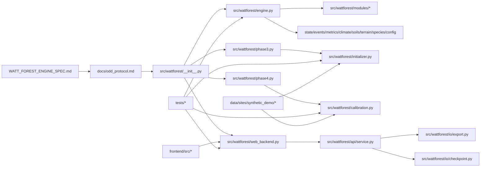

# Watt Forest App Network Map

This is a structural report of the repository's runtime graph, validation graph, and data graph.

## 1. Top-Level Shape

## 2. Runtime Layers

### 2.1 Public Package Surface

[`src/wattforest/__init__.py`](/Users/lucarobadey/Desktop/Projects/Coding/Forest%20Sim/src/wattforest/__init__.py) is the main import surface.

It re-exports:

- Core engine and domain primitives
- Manifest initialization and phase workflows
- Validation and calibration types
- FastAPI backend app factory

This is the layer notebooks, tests, and consumers import from when they want the "whole system" instead of a single module.

### 2.2 Simulation Core

[`src/wattforest/engine.py`](/Users/lucarobadey/Desktop/Projects/Coding/Forest%20Sim/src/wattforest/engine.py) is the center of the backend.

It owns:

- landscape state
- event replay
- yearly simulation loop
- checkpoint creation and restore
- derived raster/grid helpers
- climate scenario switching

The engine depends on:

- [`config.py`](/Users/lucarobadey/Desktop/Projects/Coding/Forest%20Sim/src/wattforest/config.py)
- [`state.py`](/Users/lucarobadey/Desktop/Projects/Coding/Forest%20Sim/src/wattforest/state.py)
- [`events.py`](/Users/lucarobadey/Desktop/Projects/Coding/Forest%20Sim/src/wattforest/events.py)
- [`metrics.py`](/Users/lucarobadey/Desktop/Projects/Coding/Forest%20Sim/src/wattforest/metrics.py)
- [`climate.py`](/Users/lucarobadey/Desktop/Projects/Coding/Forest%20Sim/src/wattforest/climate.py)
- [`soils.py`](/Users/lucarobadey/Desktop/Projects/Coding/Forest%20Sim/src/wattforest/soils.py)
- [`terrain.py`](/Users/lucarobadey/Desktop/Projects/Coding/Forest%20Sim/src/wattforest/terrain.py)
- [`species.py`](/Users/lucarobadey/Desktop/Projects/Coding/Forest%20Sim/src/wattforest/species.py)
- [`tuning.py`](/Users/lucarobadey/Desktop/Projects/Coding/Forest%20Sim/src/wattforest/tuning.py)
- [`modules/*`](/Users/lucarobadey/Desktop/Projects/Coding/Forest%20Sim/src/wattforest/modules)

### 2.3 Phase 3 Initialization

[`src/wattforest/initializer.py`](/Users/lucarobadey/Desktop/Projects/Coding/Forest%20Sim/src/wattforest/initializer.py) is the ingest and assembly layer.

It builds an engine from a site manifest by combining:

- DEM
- SSURGO-like soil data
- baseline and yearly climate rasters
- FIA inventory tables
- MTBS fire history
- optional LANDFIRE context

It also provides:

- manifest validation
- Phase 3 baseline execution
- Phase 4 calibration entrypoint forwarding

### 2.4 Phase 4 Calibration

[`src/wattforest/calibration.py`](/Users/lucarobadey/Desktop/Projects/Coding/Forest%20Sim/src/wattforest/calibration.py) implements:

- parameter specification loading
- metric target validation
- deterministic sampling
- rejection-ABC scoring
- best-run selection
- neutral baseline evaluation
- OAT sensitivity
- Sobol sensitivity
- artifact writing

It is tightly coupled to:

- [`validation.py`](/Users/lucarobadey/Desktop/Projects/Coding/Forest%20Sim/src/wattforest/validation.py)
- [`tuning.py`](/Users/lucarobadey/Desktop/Projects/Coding/Forest%20Sim/src/wattforest/tuning.py)
- [`initializer.py`](/Users/lucarobadey/Desktop/Projects/Coding/Forest%20Sim/src/wattforest/initializer.py)

### 2.5 Phase 5 Backend

[`src/wattforest/web_backend.py`](/Users/lucarobadey/Desktop/Projects/Coding/Forest%20Sim/src/wattforest/web_backend.py) is the FastAPI app factory.

It exposes:

- branch CRUD
- event CRUD
- replay
- metrics
- raster tiles
- GeoTIFF export
- NetCDF export

Its implementation delegates to [`src/wattforest/api/service.py`](/Users/lucarobadey/Desktop/Projects/Coding/Forest%20Sim/src/wattforest/api/service.py), which is the workspace-backed service layer.

## 3. Domain Graph

### 3.1 Spatial State

[`src/wattforest/config.py`](/Users/lucarobadey/Desktop/Projects/Coding/Forest%20Sim/src/wattforest/config.py) defines the grid geometry.

[`src/wattforest/terrain.py`](/Users/lucarobadey/Desktop/Projects/Coding/Forest%20Sim/src/wattforest/terrain.py), [`src/wattforest/soils.py`](/Users/lucarobadey/Desktop/Projects/Coding/Forest%20Sim/src/wattforest/soils.py), and [`src/wattforest/climate.py`](/Users/lucarobadey/Desktop/Projects/Coding/Forest%20Sim/src/wattforest/climate.py) define the environmental layers.

[`src/wattforest/state.py`](/Users/lucarobadey/Desktop/Projects/Coding/Forest%20Sim/src/wattforest/state.py) defines:

- `Cohort`
- `CellVegetation`
- `DisturbanceType`

[`src/wattforest/species.py`](/Users/lucarobadey/Desktop/Projects/Coding/Forest%20Sim/src/wattforest/species.py) defines the species trait table.

[`src/wattforest/events.py`](/Users/lucarobadey/Desktop/Projects/Coding/Forest%20Sim/src/wattforest/events.py) defines the event timeline.

[`src/wattforest/metrics.py`](/Users/lucarobadey/Desktop/Projects/Coding/Forest%20Sim/src/wattforest/metrics.py) defines annual summary records and pattern metrics.

### 3.2 Module Interactions

The module surface in [`src/wattforest/modules/__init__.py`](/Users/lucarobadey/Desktop/Projects/Coding/Forest%20Sim/src/wattforest/modules/__init__.py) exports:

- light
- growth
- mortality
- recruitment
- fire
- windthrow
- harvest
- hydrology
- grazing
- structure recomputation

The engine uses these modules in its yearly loop and event dispatcher.

The key structural helper is `recompute_cohort_structure`, which is shared by:

- growth
- mortality
- recruitment
- harvest
- planting
- fire recovery
- `CellVegetation.add_or_merge_cohort`

That last call is a deliberate cycle breaker: `state.py` imports the structure helper lazily inside the method rather than at module top level.

## 4. End-to-End Flows

### 4.1 Phase 3 Flow

`site_manifest.json -> LandscapeInitializer.from_site_manifest(...) -> WattForestEngine -> engine.run(...) -> summarize_engine(...) -> compare_site_patterns(...) -> phase3 outputs`

The concrete chain is:

- [`phase3.py`](/Users/lucarobadey/Desktop/Projects/Coding/Forest%20Sim/src/wattforest/phase3.py) parses CLI arguments
- [`initializer.py`](/Users/lucarobadey/Desktop/Projects/Coding/Forest%20Sim/src/wattforest/initializer.py) resolves the manifest and builds the engine
- [`validation.py`](/Users/lucarobadey/Desktop/Projects/Coding/Forest%20Sim/src/wattforest/validation.py) summarizes the final state
- [`phase3.py`](/Users/lucarobadey/Desktop/Projects/Coding/Forest%20Sim/src/wattforest/phase3.py) writes JSON artifacts

### 4.2 Phase 4 Flow

`site_manifest.json + calibration_spec.json -> run_phase4_calibration(...) -> sample runs -> best run + neutral baseline + OAT + Sobol -> phase4 outputs`

The concrete chain is:

- [`phase4.py`](/Users/lucarobadey/Desktop/Projects/Coding/Forest%20Sim/src/wattforest/phase4.py) handles CLI arguments
- [`calibration.py`](/Users/lucarobadey/Desktop/Projects/Coding/Forest%20Sim/src/wattforest/calibration.py) loads the spec and runs the calibration surface
- [`tuning.py`](/Users/lucarobadey/Desktop/Projects/Coding/Forest%20Sim/src/wattforest/tuning.py) applies parameter overrides
- [`validation.py`](/Users/lucarobadey/Desktop/Projects/Coding/Forest%20Sim/src/wattforest/validation.py) computes the snapshot used for scoring

### 4.3 Frontend Flow

`frontend/index.html -> frontend/src/main.tsx -> App -> useScenarioModel -> view components`

The view split is:

- `MapView` for raster and geometry display
- `TimelineView` for event editing
- `CompareView` for branch comparison

`useScenarioModel` is the state machine that connects the UI to either:

- the live HTTP API, or
- the mock in-memory API

### 4.4 Backend API Flow

`frontend -> /api/* -> BranchRepository -> WattForestEngine.load_checkpoint/run/export/tile`

`BranchRepository` is the stateful hub:

- branch metadata in JSON
- events in JSON
- engine baseline checkpoint in pickle
- replay cache on disk

## 5. Data Graph

### 5.1 Synthetic Demo Package

[`data/sites/synthetic_demo/site_manifest.json`](/Users/lucarobadey/Desktop/Projects/Coding/Forest%20Sim/data/sites/synthetic_demo/site_manifest.json) is the hub for the demo site.

It points to:

- DEM raster
- SSURGO vector
- baseline climate rasters
- yearly climate override rasters for 2021 and 2024
- FIA tables
- MTBS fire history
- optional LANDFIRE rasters
- validation targets
- calibration spec

`site_manifest.json` is the central node that drives:

- Phase 3 initialization
- Phase 3 validation
- Phase 4 calibration
- notebook examples
- smoke tests

### 5.2 Expected Outputs

The `expected/phase3` and `expected/phase4` folders are reference artifacts, not runtime inputs.

They encode what the workflows should produce when the demo package is run correctly.

## 6. Test Map

The tests are layered around the same runtime graph:

- `test_phase0.py` and `test_growth.py` cover baseline engine behavior
- `test_event_replay.py` and `test_phase2_disturbances.py` cover replay and disturbance semantics
- `test_phase3_initialization.py` covers manifest ingest
- `test_phase3_validation.py` covers summaries and baseline comparison
- `test_phase4_calibration.py` covers calibration and sensitivity
- `test_phase5_backend.py` and `test_phase5_export.py` cover the API and export surface
- `test_synthetic_demo_package.py` validates the demo package shape and artifacts
- `test_spec_completion_core.py` pins climate overrides, polygon replay determinism, and calibration accept/reject behavior

## 7. Important Couplings

### 7.1 Backend/UI Couplings

- The frontend map view currently hardcodes `/api/...` for tile URLs instead of using the API abstraction.
- `CompareView` expects branch payloads to include metrics immediately.
- `useScenarioModel` maintains both selected IDs and selected objects, which is convenient but introduces state duplication.

### 7.2 Engine/State Couplings

- Runtime state is a blend of event-sourced history and persistent in-engine overlays.
- Climate shifts and hydrology modifiers persist as arrays on the engine, not as standalone events.
- Checkpoints are pickle-based, so class layout changes can affect restore compatibility.

### 7.3 Import-Cycle Avoidance

- `state.py` lazily imports structure recomputation inside a method.
- `initializer.py` imports calibration only inside the Phase 4 forwarding method.

## 8. Summary

The repo has a clear spine:

`spec -> runtime package -> simulation engine -> phase workflows -> API/frontend -> tests/demo data`

The strongest connections are:

- `site_manifest.json` as the ingest hub
- `WattForestEngine` as the runtime core
- `BranchRepository` as the Phase 5 state hub
- `useScenarioModel` as the frontend state hub
- `tests/` as the contract net that pins each layer

